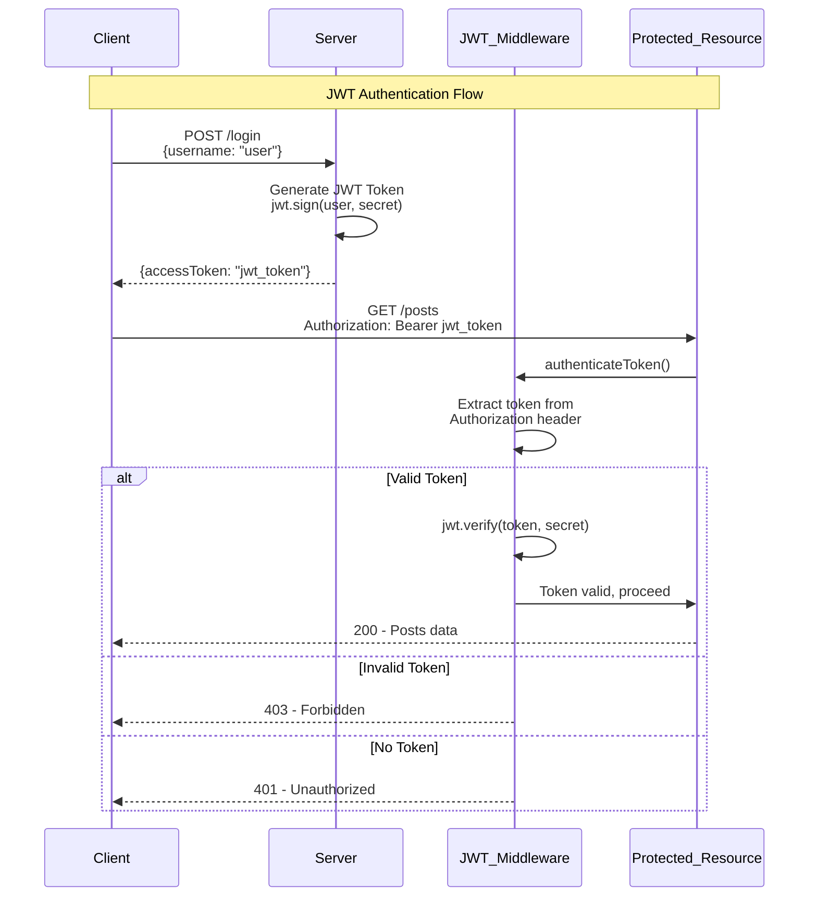

# JWT_Auth

JWT authentication using Nodejs and Express.

This application creates tokens on the server side, sends tokens to users and authenticate tokens back on the server side.
Additionally, it makes use of refresh tokens to increase security and allows revocation of user privileges.

## Architecture Overview

## API Endpoints

- **POST `/login`** - Authenticate user and receive JWT token
- **GET `/posts`** - Access protected resource (requires valid JWT token)

## Authentication Flow

1. **Login**: Client sends credentials to `/login` endpoint
2. **Token Generation**: Server creates JWT token with user information
3. **Token Storage**: Client stores the received JWT token
4. **Protected Requests**: Client includes token in `Authorization: Bearer <token>` header
5. **Token Validation**: Server middleware validates token before granting access
6. **Access Control**: Valid tokens grant access, invalid/missing tokens are rejected
